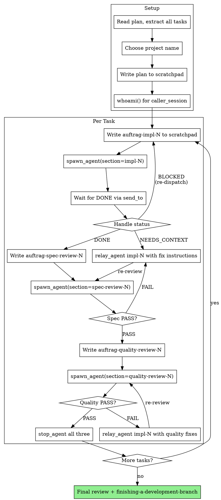

# Swarm-Driven Development

Execute plans by dispatching visible YesMem swarm agents per task, with two-stage review (spec compliance, then code quality) after each.

**Overrides** `superpowers:subagent-driven-development` — uses YesMem swarm (`spawn_agent`, `scratchpad`, `send_to`) instead of invisible Claude Code `Agent` tool. All agents run in separate visible terminals.

## When to Use

- Have an implementation plan with mostly independent tasks
- Want to stay in current session as orchestrator
- Want to SEE agent work in real-time (vs. invisible subagents)

## Core Tools

| Tool | Replaces | Purpose |
|------|----------|---------|
| `spawn_agent(project, section, model?)` | `Agent` tool | Spawn visible agent in own terminal |
| `scratchpad_write(project, section, content)` | Agent prompt parameter | Pass task context to agent |
| `scratchpad_read(project, section)` | Agent return value | Read agent results |
| `send_to(target, content)` | Inline result | Agent notifications |
| `relay_agent(to, content)` | N/A (new) | Inject instructions into running agent |
| `stop_agent(to)` | Automatic | Explicit agent cleanup |
| `list_agents(project)` | N/A | Monitor agent status |

## Process



## Setup Phase

```
1. Read plan file — extract ALL tasks with full text (don't make agents read the plan)
2. Choose project name (e.g. "feature-auth")
3. whoami() → get your session_id for caller_session
4. scratchpad_write(project, section="plan", content=full plan text)
```

## Per-Task Cycle

### 1. Dispatch Implementer

```
scratchpad_write(project=PROJECT, section="auftrag-impl-N", content=IMPLEMENTER_PROMPT)
spawn_agent(project=PROJECT, section="impl-N",
            caller_session=MY_SESSION, model=MODEL_CHOICE)
```

Write the full task text + context into the scratchpad auftrag. See `implementer-prompt.md` for template.

**Model selection:** Use `haiku` for mechanical tasks (1-2 files, clear spec), `sonnet` for integration tasks, `opus` for architecture/judgment tasks.

### 2. Wait for Implementer

Agent sends `send_to` with status when done. Handle:

| Status | Action |
|--------|--------|
| **DONE** | Proceed to spec review |
| **DONE_WITH_CONCERNS** | Read concerns from `ergebnis-impl-N`, address if needed |
| **NEEDS_CONTEXT** | `relay_agent(to="impl-N", content="CONTEXT: ...")` — inject missing info |
| **BLOCKED** | Assess: provide more context, re-dispatch with stronger model, or break task down |

### 3. Spec Compliance Review

```
scratchpad_write(project=PROJECT, section="auftrag-spec-review-N", content=SPEC_REVIEW_PROMPT)
spawn_agent(project=PROJECT, section="spec-review-N",
            caller_session=MY_SESSION, model="sonnet")
```

See `spec-reviewer-prompt.md`. Reviewer reads actual code, compares to spec.

- **PASS** → proceed to quality review
- **FAIL** → `relay_agent(to="impl-N", content="FIX: [issues from reviewer]")`, then re-review

### 4. Code Quality Review

```
scratchpad_write(project=PROJECT, section="auftrag-quality-review-N", content=QUALITY_REVIEW_PROMPT)
spawn_agent(project=PROJECT, section="quality-review-N",
            caller_session=MY_SESSION, model="sonnet")
```

See `code-quality-reviewer-prompt.md`. Only after spec compliance passes.

- **PASS** → stop all agents for this task, mark complete
- **FAIL** → `relay_agent(to="impl-N", content="QUALITY: [issues]")`, then re-review

### 5. Cleanup

```
stop_agent(project=PROJECT, to="impl-N")
stop_agent(project=PROJECT, to="spec-review-N")
stop_agent(project=PROJECT, to="quality-review-N")
```

## Scratchpad Sections (Convention)

| Section | Writer | Content |
|---------|--------|---------|
| `plan` | Orchestrator | Full plan text |
| `auftrag-impl-N` | Orchestrator | Implementer task with full context |
| `ergebnis-impl-N` | Implementer | Implementation report (status, files, tests) |
| `auftrag-spec-review-N` | Orchestrator | Spec + implementer report for reviewer |
| `ergebnis-spec-review-N` | Spec Reviewer | Review verdict (PASS/FAIL + details) |
| `auftrag-quality-review-N` | Orchestrator | Quality review task |
| `ergebnis-quality-review-N` | Quality Reviewer | Quality verdict |

## Advantages over Invisible Subagents

- **Visible:** Watch agents work in real-time in separate terminals
- **Crash recovery:** Daemon auto-restarts crashed agents with quarantine
- **relay_agent:** Inject fix instructions into running implementer (no re-spawn needed)
- **Budget control:** `token_budget` and `max_turns` per agent
- **Model per agent:** `haiku` for simple, `opus` for complex
- **Status monitoring:** `list_agents()` shows all running agents
- **Persistent results:** Scratchpad survives agent crashes

## Red Flags

- **Never** dispatch implementation agents in parallel (conflicts)
- **Never** skip either review stage
- **Never** proceed with unfixed review issues
- **Never** make agents read the plan file — paste full task text into scratchpad
- **Always** stop agents after their task is done (no zombies)
- **Always** spec review BEFORE quality review (wrong order = waste)

## Integration

- **superpowers:writing-plans** — creates the plan this skill executes
- **superpowers:test-driven-development** — implementer agents follow TDD
- **superpowers:finishing-a-development-branch** — after all tasks complete
- **superpowers:requesting-code-review** — template for quality reviewer
